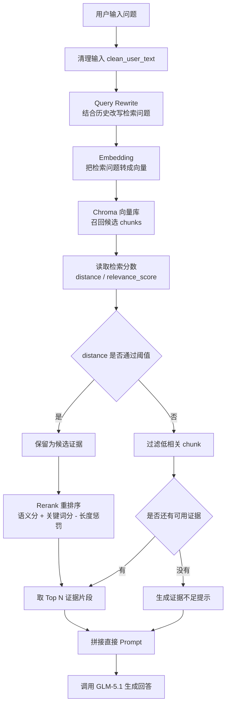

# LangChain 实战：从最小 Agent 到可调试 RAG 知识库问答

## 前言

前面已经用 LangChain 跑通了一个最小 Agent：模型可以正常对话，也可以调用时间、天气、本地文件读取这些工具。

但只会调用工具还不够。真实项目里更常见的需求是：让模型基于自己的资料回答问题，比如项目文档、团队规范、学习笔记、产品手册等。

这类场景通常不会一上来做微调，而是先做 RAG。

项目地址：

<https://github.com/HJunLong601/mylangchain>

这篇文章记录一下这个 Demo 里 RAG 能力的完整演进过程。当前实现已经不只是“把文档塞给模型”这么简单，而是包含了：

- Chroma 本地持久化向量库
- 直接 Prompt 版 RAG
- Query Rewrite
- 检索分数和阈值过滤
- 教学版 Rerank
- 全链路日志输出

最终链路如下：

```text
用户问题
-> Query Rewrite
-> 向量检索召回候选 chunk
-> distance 阈值过滤
-> Rerank 重排序
-> Top N 证据片段拼进 Prompt
-> 模型基于证据回答
```

## RAG 解决的是什么问题

大模型本身有通用知识，但默认不知道你的本地资料。

比如你问：

```text
根据我的 LangChain 学习笔记，总结下一步应该学什么？
```

如果不把本地笔记交给模型，模型只能根据通用经验回答。RAG 的核心作用就是在模型回答之前，先从你的知识库里检索出相关内容，再把这些内容作为上下文交给模型。

RAG 和微调的区别也很明显：

| 方案 | 做什么 | 适合场景 |
|---|---|---|
| RAG | 给模型补充资料 | 文档问答、知识库、企业资料查询 |
| 微调 | 改变模型行为习惯 | 固定格式、特定风格、任务偏好 |

知识库问答优先考虑 RAG。只有当你要改变模型的输出习惯、风格或稳定行为时，才更需要考虑微调。

## 当前项目结构

RAG 相关代码主要在这几个文件里：

```text
app/
  main.py       # 主流程：Query Rewrite、检索、Rerank、拼 Prompt、调用模型
  rag.py        # RAG 引擎：文档加载、切分、向量库、检索、重排
  tools.py      # 保留工具版 RAG 示例，用于对比 ToolMessage 写法
data/
  notes.txt
  langchain_rag.md
```

当前项目仍然保留了 Agent 和 Tool 的代码，但默认 RAG 主链路已经从“工具调用版”改成了“直接 Prompt 版”。

原因是知识库问答通常更适合程序固定执行检索流程，而不是每次都让模型自己决定是否调用检索工具。这样流程更稳定，也更方便调试。

## 当前 RAG 调用流程

先放一张当前版本的流程图，后面再拆开讲每个环节。



这张图里有两个点比较重要：

- 向量库返回的是候选片段，不是最终答案。
- 最终进入模型的是格式化后的证据文本，不是 embedding 向量。

## 环境配置

`.env` 里和 RAG 相关的配置大概如下：

```env
ZAI_API_KEY=你的智谱 API Key
ZAI_BASE_URL=https://open.bigmodel.cn/api/paas/v4/
MODEL_NAME=glm-5.1

EMBEDDING_MODEL=embedding-3
EMBEDDING_DIMENSIONS=1024

RAG_VECTOR_DIR=.rag_chroma
RAG_COLLECTION_NAME=mylangchain_knowledge
RAG_MAX_DISTANCE=1.2
RAG_RETRIEVAL_CANDIDATES=8
RAG_RERANK_ENABLED=true
RAG_QUERY_REWRITE_ENABLED=true
RAG_REWRITE_HISTORY_MESSAGES=6
```

这里虽然使用的是 LangChain 的 `ChatOpenAI` 和 `OpenAIEmbeddings`，但实际接的是智谱的 OpenAI 兼容接口。

也就是说，应用层可以继续使用 OpenAI 风格 SDK，底层模型服务可以换成智谱或者其他兼容平台。

## 文档加载和切分

当前 Demo 只支持 `data/` 目录下的 `.txt` 和 `.md` 文件。

文档读取后会被包装成 LangChain 的 `Document`：

```python
Document(
    page_content=text,
    metadata={
        "source": path.name,
        "path": str(path),
    },
)
```

`page_content` 是正文，`metadata` 保存来源信息。后面检索命中以后，模型回答时就能带上来源文件名。

文本切分使用的是固定窗口：

```python
def split_text_into_chunks(
    text: str,
    chunk_size: int = 400,
    chunk_overlap: int = 80,
) -> list[str]:
    chunks: list[str] = []
    start = 0

    while start < len(text):
        end = min(start + chunk_size, len(text))
        chunk = text[start:end].strip()
        if chunk:
            chunks.append(chunk)

        if end == len(text):
            break

        start = end - chunk_overlap

    return chunks
```

这里没有一开始就引入复杂 splitter，主要是为了看清楚 RAG 的主流程。

切分时有两个参数比较关键：

- `chunk_size`：每个片段最多多少字符
- `chunk_overlap`：相邻片段之间保留多少重叠内容

chunk 太大，检索结果容易混入无关内容；chunk 太小，语义可能不完整。`overlap` 可以缓解“一个知识点刚好被切断”的问题。

## Embedding 和 Chroma 持久化

早期版本用的是 `InMemoryVectorStore`，进程一结束索引就没了。现在已经换成了 Chroma：

```python
vector_store = Chroma(
    collection_name=get_collection_name(),
    embedding_function=embeddings,
    persist_directory=str(vector_store_dir),
)
vector_store.add_documents(chunked_documents)
```

默认持久化目录是：

```text
.rag_chroma/
```

这样第一次构建索引后，下次启动可以直接复用，不需要每次都重新向量化全部文档。

为了判断知识库有没有变化，项目里还额外保存了一个签名文件：

```text
.rag_chroma/knowledge_signature.json
```

签名里记录文件名和最后修改时间。逻辑很直接：

```text
签名没变 -> 复用已有 Chroma 索引
签名变化 -> 清空旧索引并重建
```

这一步很实用。否则每次运行都重新 embedding，速度慢，也浪费 token 和接口调用。

## 为什么改成直接 Prompt 版 RAG

一开始 RAG 是作为工具注册给 Agent 的：

```text
用户问题
-> 模型决定调用 search_local_knowledge
-> 工具返回检索结果
-> LangChain 包装成 ToolMessage
-> 模型基于 ToolMessage 回答
```

这个版本适合学习 Agent 工具调用机制。你可以看到模型什么时候发起工具调用，也可以看到 ToolMessage 里到底返回了什么。

但知识库问答本身更适合直接 Prompt：

```text
用户问题
-> 程序先检索知识库
-> 程序过滤和重排证据
-> 程序拼好 Prompt
-> 模型回答
```

直接 Prompt 的好处是流程更可控。

尤其后面加了阈值过滤、Query Rewrite、Rerank 之后，如果还完全依赖模型自己决定是否调用工具，调试会更绕。现在主流程在 `main.py` 里是显式的，日志也更清楚。

当前 Prompt 大致长这样：

```text
你正在使用“直接 Prompt 版 RAG”回答问题。

【实际用于检索的问题】
RAG 和微调有什么区别？

【本地知识库检索结果】
[来源] langchain_rag.md (chunk #1)
[distance] 0.358324
[relevance_score] 0.736201
[rerank_score] 0.615341
[内容]
...

【用户问题】
它和微调有什么区别？
```

注意这里同时保留了两个问题：

- 实际用于检索的问题：改写后的 query
- 用户问题：用户原始表达

这样既能提高检索质量，又能保证回答仍然面向用户原问题。

## Query Rewrite：处理多轮对话里的指代

多轮对话里经常会出现这种问题：

```text
第一轮：RAG 是什么？
第二轮：它和微调有什么区别？
```

人能知道“它”指 RAG，但向量检索只看到“它和微调有什么区别？”，检索效果就可能变差。

所以在检索之前，项目会先做 Query Rewrite：

```python
rewrite_query_for_rag(
    user_question=question,
    conversation_messages=messages,
    model=rewrite_model,
)
```

它会参考最近几轮对话，把当前问题改写成一个独立的检索问题。

例如：

```text
原问题：它和微调有什么区别？
改写后：RAG 和微调有什么区别？
```

这里有一个实现细节：历史消息里保存的 user 内容已经是增强 Prompt，不是原始用户问题。所以代码里加了 `extract_original_user_question()`，从增强 Prompt 里把原始用户问题取出来，避免把一大段检索结果也塞给 Query Rewrite。

这类小细节很容易被忽略，但会直接影响改写质量。

## 检索分数和阈值过滤

早期只用 `similarity_search()`，只能拿到文档本身。现在改成：

```python
raw_results = vector_store.similarity_search_with_score(
    query,
    k=max_results,
)
```

这样可以拿到 Chroma 返回的 `distance`。

当前项目里的约定是：

```text
distance 越小，越相关
relevance_score 越接近 1，越相关
```

`relevance_score` 是为了方便观察做的换算：

```python
def distance_to_relevance_score(distance: float) -> float:
    return 1 / (1 + max(distance, 0))
```

只要做 RAG，就一定要注意一个问题：向量库通常会尽量返回结果，但返回结果不代表结果一定相关。

所以项目加了阈值：

```env
RAG_MAX_DISTANCE=1.2
```

只有满足下面条件的 chunk 才能继续进入后续流程：

```text
distance <= RAG_MAX_DISTANCE
```

如果没有任何片段通过阈值，Prompt 里会明确告诉模型：

```text
没有检索到通过相关性阈值的知识片段。
这表示当前知识库没有足够可靠的证据支持回答这个问题。
```

这样模型就不会拿着低质量上下文硬编答案。

## Rerank：召回之后再排序

向量检索更擅长“召回”，但召回顺序不一定最适合最终回答。

所以当前项目加了一个教学版 Rerank：

```text
Chroma 先召回 RAG_RETRIEVAL_CANDIDATES 条候选
-> 过滤掉超过 distance 阈值的结果
-> Rerank 重新排序
-> 只取 Top 3 进入 Prompt
```

相关配置：

```env
RAG_RETRIEVAL_CANDIDATES=8
RAG_RERANK_ENABLED=true
```

当前 Rerank 没有接专门模型，而是用了一个规则版实现，方便学习和调试。

它主要看三个信号：

- `relevance_score`：向量相似度换算分
- `keyword_score`：query 和 chunk 的关键词重合
- `length_penalty`：chunk 过短或过长时轻微扣分

核心分数：

```python
rerank_score = (
    result.relevance_score * 0.7
    + keyword_score * 0.3
    - length_penalty
)
```

这个公式不是生产最优解，但教学效果很好。因为你能在日志里看到每一项分数：

```text
Rerank before #1 retrieval_rank=1 source=langchain_rag.md ...
Rerank after #1 retrieval_rank=1 source=langchain_rag.md rerank_score=0.615341 ...
```

生产环境可以把这层替换成专门的 reranker 模型，比如 BGE Reranker、Cohere Rerank、Jina Reranker，或者云厂商提供的重排序 API。

## 日志怎么帮助调试 RAG

RAG 很容易变成黑盒：用户问了一个问题，系统给了一个答案，但中间到底搜到了什么没人知道。

这个 Demo 里刻意把日志打得比较细：

- 原始用户问题
- Query Rewrite 后的问题
- Chroma 召回了哪些 chunk
- 每个 chunk 的 `distance`
- 每个 chunk 的 `relevance_score`
- 是否通过阈值
- Rerank 前的顺序
- Rerank 后的顺序
- `keyword_score`
- `length_penalty`
- `rerank_score`
- 最终拼给模型的 Prompt

调 RAG 时可以按这个顺序排查：

```text
答案不对
-> 看 Query Rewrite 是否改错
-> 看 Chroma 是否召回了正确 chunk
-> 看 distance 是否被阈值过滤
-> 看 Rerank 是否把关键 chunk 排到前面
-> 看最终 Prompt 是否表达清楚
```

这比只看最终回答要有效得多。

## 当前实现的边界

这个项目适合学习 RAG 主链路，但还不是生产系统。

当前边界主要有：

- 只支持 `.txt` 和 `.md`
- 文本切分是固定窗口
- Rerank 是教学规则，不是模型重排
- 没有混合检索
- 没有权限控制
- 没有增量索引任务队列
- 没有系统化评估集

这些边界不是坏事。学习阶段先把主链路跑通，比一开始堆一堆组件更重要。

## 生产环境可以怎么升级

如果继续往生产方向走，可以从下面几个方向扩展。

文档解析可以从 `.txt` / `.md` 扩展到：

- PDF
- Word
- HTML
- 网页
- 表格
- 数据库内容

常见库包括：

- `pypdf`
- `unstructured`
- `beautifulsoup4`
- `python-docx`
- `pandas`

文本切分可以替换成：

- `RecursiveCharacterTextSplitter`
- markdown-aware splitter
- token-aware splitter
- 基于标题层级的结构化切分

向量数据库可以从本地 Chroma 升级到：

- Qdrant
- Milvus
- Weaviate
- Pinecone
- pgvector
- Elasticsearch / OpenSearch
- Redis Vector Search

检索策略可以继续加：

- BM25 + 向量混合检索
- Multi-query retrieval
- Query expansion
- 专门 reranker 模型
- 召回和重排评估集

观测和评估可以考虑：

- LangSmith
- RAGAS
- 自建日志看板
- APM / tracing

## 下一步：把 RAG 流程迁移到 LangGraph

RAG 这条主线现在已经比较完整了。继续做当然还可以加 PDF、混合检索、模型 Rerank，但从学习路线看，下一步更适合进入 LangGraph。

现在的流程还是脚本式的：

```text
main.py 按顺序调用：
Query Rewrite
-> Retrieve
-> Rerank
-> Build Prompt
-> Generate
```

真实 Agent 项目里，流程经常会有状态、多分支和条件判断。比如：

- 检索结果为空时走兜底
- 分数太低时要求用户补充问题
- 回答前检查证据是否足够
- 某些节点失败后重试

这些就适合用 LangGraph 表达。

可以先把当前 RAG 链路改成一个最小图：

```text
START
-> rewrite_query
-> retrieve
-> rerank
-> build_prompt
-> generate_answer
-> END
```

这样可以自然学到：

- `State`：流程里共享的数据
- `Node`：每一个处理步骤
- `Edge`：节点之间怎么流转
- `Conditional Edge`：根据检索结果决定下一步

这一步不是推翻当前代码，而是把现在已经写好的 RAG 能力重新组织成更工程化的工作流。

## 总结

这个阶段的目标不是写一个花哨的聊天机器人，而是把 RAG 的关键链路拆开看清楚。

当前 Demo 已经覆盖了几个比较重要的工程点：

- 本地文档如何变成 chunk
- chunk 如何通过 embedding 写入 Chroma
- 用户问题如何被改写成检索 query
- 向量检索结果如何用 distance 判断可靠性
- 候选 chunk 如何通过 Rerank 重新排序
- 最终证据如何进入 Prompt

理解这些以后，再去看更复杂的知识库系统，就不会只看到一堆名词，而是能分清每个模块到底解决什么问题。

RAG 的核心不是“把资料塞给模型”，而是：

```text
找到合适的资料
过滤掉不可靠的资料
把最有用的资料组织给模型
让模型基于证据回答
```

这条线跑通以后，再进入 LangGraph 会顺很多。
