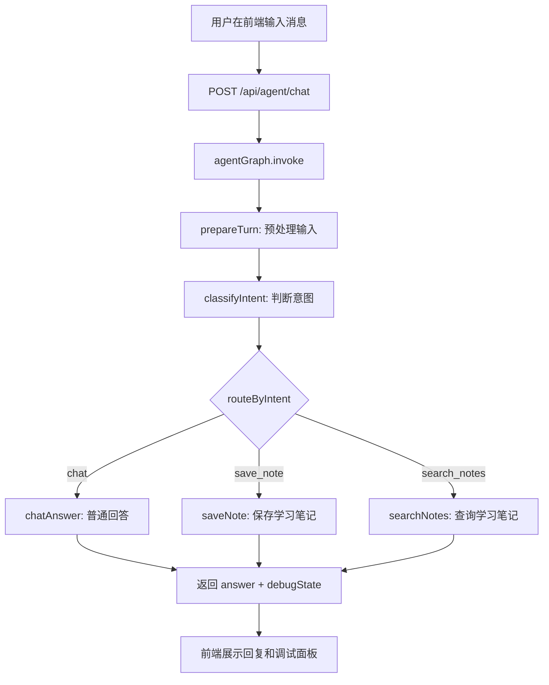

# LangGraph 个人 Agent 工作台

这个目录是新的主线工程：不再继续堆零散小 demo，而是一步步搭建一个真正可以使用的个人学习 Agent。

当前目标是先做出第一版可运行闭环：

```text
前端聊天界面
-> POST /api/agent/chat
-> agentGraph
-> State 预处理
-> 意图分类
-> 条件路由
-> 普通回答 / 保存笔记 / 查询笔记
-> 返回回答和调试信息
```

## 运行方式

```powershell
cd E:\AIProject\mylangchain\langgraph_agent_workspace
npm install
npm run dev
```

启动后访问：

```text
http://localhost:5174
```

后端接口地址：

```text
http://localhost:3002
```

## 当前实现了什么

| 能力 | 状态 | 说明 |
|---|---|---|
| 统一聊天入口 | 已完成 | 前端不再选择 demo graph，而是直接和 Agent 对话 |
| 统一 Agent Graph | 已完成 | `server/graphs/agentGraph.ts` |
| State 流转 | 已完成 | `question`、`intent`、`answer`、`steps` 等都在 State 中传递 |
| 条件路由 | 已完成 | 根据意图进入 `chatAnswer`、`saveNote`、`searchNotes` |
| 短期记忆 | 已完成 | `MemorySaver` + `thread_id` |
| 学习笔记工具 | 已完成 | 保存笔记、查询笔记，数据存在 JSON 文件 |
| 调试面板 | 已完成 | 前端展示 intent、routeReason、steps、debug JSON |
| 真实模型调用 | 可选 | 配置 OpenAI 兼容 API 后可调用 GLM 等模型 |

## 和旧 demo 的关系

旧目录里的几个 graph 现在被收敛成一个 Agent 内部能力：

| 旧 demo | 新 Agent 中的对应能力 |
|---|---|
| `simpleGraph` | `START -> prepareTurn -> classifyIntent -> ... -> END` 主链路 |
| `stateGraph` | 使用统一 State 传递输入、意图、工具结果、最终回答 |
| `conditionalGraph` | `addConditionalEdges` 根据 intent 路由 |
| `memoryGraph` | `MemorySaver` 根据 `thread_id` 保存短期记忆 |

所以用户不需要再关心运行哪个 demo。后面所有能力都会继续加到 `agentGraph.ts` 这条主线上。

## 主要文件

```text
langgraph_agent_workspace/
├─ server/
│  ├─ index.ts                  # 后端 API 入口
│  ├─ graphs/
│  │  └─ agentGraph.ts           # 统一 Agent Graph
│  ├─ lib/
│  │  ├─ assistantModel.ts       # 模型调用封装，可接 GLM
│  │  └─ learningStore.ts        # 本地学习笔记存储
│  ├─ data/
│  │  └─ learning-notes.json     # 学习笔记 JSON 文件
│  └─ types.ts                   # 后端核心类型
└─ web/
   ├─ index.html
   └─ src/
      ├─ App.tsx                 # 聊天界面 + 调试面板
      └─ styles.css
```

## Agent 执行流程



## 如何接入智谱 GLM

当前 `assistantModel.ts` 支持 OpenAI 兼容接口。复制 `.env.example` 为 `.env`，然后配置：

```env
OPENAI_API_KEY=你的智谱APIKey
OPENAI_BASE_URL=智谱OpenAI兼容接口地址
OPENAI_MODEL=glm-5
```

如果不配置 API Key，Agent 会使用本地规则回复。这样可以先学习 LangGraph 主链路，不会因为模型配置卡住。

## 可以测试的输入

普通对话：

```text
我正在学习 LangGraph，帮我解释一下 State。
```

保存学习笔记：

```text
把这句话保存成学习笔记：State 是节点之间共享和流转的数据。
```

查询学习笔记：

```text
之前的笔记里有关于 State 的内容吗？
```

测试短期记忆：

```text
你还记得我刚才问了什么吗？
```

## 下一步

下一步不新增独立 demo，而是在这个 Agent 上继续增强：

1. 把保存笔记、查询笔记改造成更标准的 Tool 抽象。
2. 接入真正的 RAG：学习笔记和文档向量化后走检索增强回答。
3. 加入 React Flow，把 `agentGraph` 的节点和边画出来。
4. 把 JSON 存储替换成 SQLite，让会话和笔记都能长期保存。
